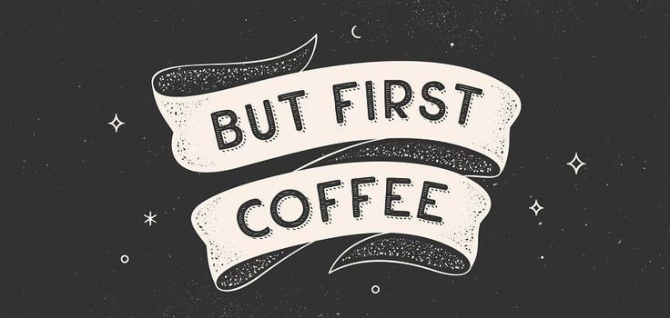

### Hi there 👋, Sanogo Latif
#### Research analysis, ML, and Data visualization

A lover of data science, coffee, and good music.
Here to utilize data for environmental and entrepreneurial growth.

## Skills:
- 🐍 Python
- 🧮 R 
- 📅 SQL
- 📈 Tableau

##
- 🔭 I’m currently working on contributing to open source projects 
- 🌱 I’m currently learning market trend analyses and web scraping 
- 👯 I’m looking to collaborate on Research analysis projects involving ML or BI  
- ⚡ Fun fact: I'm a dog person 

